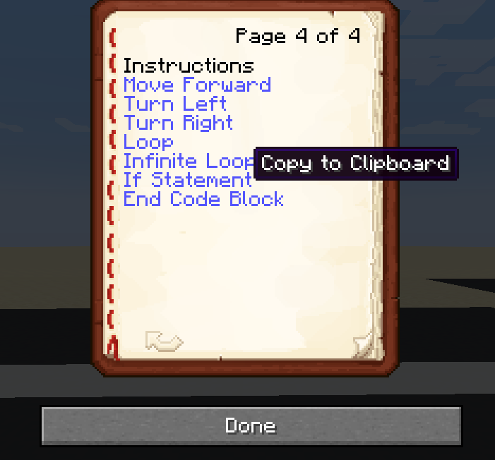
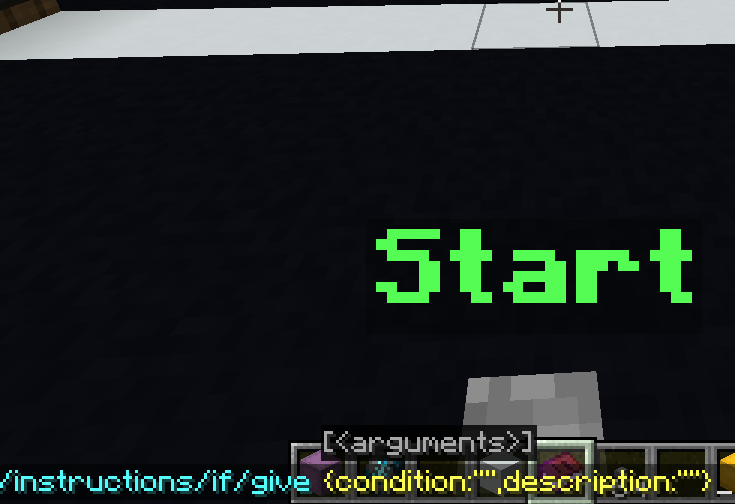

# Barrelbot

_v0_5_

# Table of Contents
[What is BarrelBot?](https://github.com/whimc/Barrelbot/blob/main/readme.md#what-is-barrelbot)

[What is its Purpose?](https://github.com/whimc/Barrelbot/blob/main/readme.md#what-is-its-purpose)

[Overview of Components](https://github.com/whimc/Barrelbot/blob/main/readme.md#overview-of-components)
- Start Area
- Actors
- Course Area
- Instructions
- Functions
- Resource Pack

[How to Make and Use Puzzles](https://github.com/whimc/Barrelbot/blob/main/readme.md#how-to-make-and-use-puzzles)
- Puzzle Functionality
- Making a Puzzle

[Tools](https://github.com/whimc/Barrelbot/blob/main/readme.md#tools)
- Puzzle Wand
- Dev Book
- Cloning

## What is BarrelBot?
BarreblBot is an innovative learning bot created on Minecraft: Java Edition that helps users learn basic fundamentals of programming. The bot is mainly targeted towards children to be used as an introductory tool that integrates gaming with learning. Minecraft: Java Edition was chosen as the base platform due to its world wide popularity and its ease of use for children. 

## What is its Purpose?
BarrelBots aligns with the fundamental goals of a programming system, especially in regards to supporting and encouraging new ways of thinking and enabling programmers to see and understand the execution of their programs. Through the platform, users are able to test out different sets of programming instructions in order to solve and then create their own puzzles. Furthermore, the Barrelbot displays the programming instructions as it moves throughout a task, which allows users to visualize the fruits of their work. They are pushed to think outside the box on how to apply what they know and have learned to future programming work. 

## Overview of Components

### Start Area

**Start Button**: 

**Hopper**: 

**Shulker Box**: 

### Actors

**BarrelBot**: 

    * Created with Features > Spawn Bot in dev book
    * Will face the way that you were facing when you spawn it
    * Make sure you are not standing directly over the run button when you spawn the bot or it will spawn over the button
    * To delete the barrelbot, click Features > Delete Bot

**Dispenser Bot**:

    * First, create a barrelbot and load in it any instructions you want the dispenser bot to have
    * Once you’ve set it up, stand near it and click Features > Convert to Dispenser
    * To make changes, go to Features > Convert to Barrel, make any changes you would like, then convert it back to a dispenser bot
    * Destroyed the same way as barrel bots

### Course Area

### Instructions

These are the actual commands the barrelbots execute, and you can give them to yourself in the Instructions tab of the dev book

Most instructions can be acquired without any configuration. These include:

* Move forward
* Move down
* Turn left
* Turn right
* End code block
* Infinite loop

Some instructions require further specifications. They will copy the instruction command to your clipboard, which you will then have to paste in chat and configure by adding text to the command.\
\
These configurable instructions include:

* If statements
    * the instruction command contains two parts: {condition: " ", description: " "}. 
    * {condition:”  ”}
        * this is the condition that the if statement checks for. It is formatted in the same way that the `execute if` subcommand is
        * Example: To check if the block ahead is air, you would insert “`if block ^ ^ ^1 air`” into the condition quotation marks
        * Coordinate guide (these all the characters to place into the condition):
            * Forward: ^ ^ ^1
            * Backwards: ^ ^ ^-1
            * Left: ^1 ^ ^
            * Right: ^-1 ^ ^
            * Up: ~ ~1 ~
            * Down: ~ ~-1 ~
    * {description:”  “}
        * The text that shows in the tooltip of the item
        * Just formatted plain text, no need for JSON shenanigans
* Counter Loops
    * {cycles: }
        * Number of times to repeat the loop
    * To-do: add while loops with configurable condition statements
* While loops
    * Configurations the same as If statements

### Functions

Spawns as container block with a message saying "click to link function item"

You can link a function item by either clicking on the block with the item in your hand or by standing near the function you want to link it to and clicking Features > Link Function Item

### Resource Pack

## How to Make and Use Puzzles

### Puzzle Functionality 

### Making a Puzzle

**Creating a puzzle**:

All puzzles are defined by a primary puzzle entity, which is located at the puzzle’s activation button. To create a puzzle, open your dev book and click:

Puzzle > Create Puzzle

If there is not already a button there, this will create the button and puzzle entity at your feet. You can break and replace this button without deleting the puzzle, and any button type will work.

**Linking to a puzzle**: 

Whenever you’re editing a puzzle, you should always link yourself to the puzzle that you’re working on. This will ensure that any bots you spawn are linked to that puzzle and will activate when you press the corresponding button. You can do this with:

Puzzle > Link to Puzzle

You will also automatically link to a puzzle when you spawn it.

**Deleting a puzzle**:

Delete the puzzle *nearest to you* with:

Puzzle > Delete Puzzle

**Resetting all puzzles**:

You can reset all puzzles using Puzzle > Reset all puzzles.

This will stop any puzzles that were left running and restore a puzzle’s item box to its original state.

**Seeing and changing boundaries**: 

Boundaries are set by placing **light blocks** with a **light level of 0**. When a player touches one of these blocks, any puzzle-bound items in their inventory will be transported back to their appropriate puzzle.

**Adding in barrelbots and dispenser bots**:

**Attaching instructions to a puzzle**:

**Setting Puzzle Items**:

If you want to restrict a puzzle to only allow a specific set of items, you can do the following:

1. Keep track of which direction you were facing when you spawned the puzzle (you can check this by pressing f3+b, and a blue line will appear facing the direction the puzzle entity is facing
2. Put a yellow shulker box (or other container block) 1 block behind and 1 block below the puzzle
3. Place a hopper to the left of the shulker box facing it
4. Place any items you want the puzzle to have in the shulker box
5. Click Puzzle > Set Puzzle Items

These items are now bound to a puzzle. If a player in survival mode tries to take items out of the boundaries of the puzzle, they will get transported back to the hopper and filtered back into the shulker box.

**Customized instructions**:

**Success conditions**:

The puzzle manager is coded to have configurable success conditions, so we can have different ways of measuring whether a puzzle is “complete”, like having all barrel bots land on a green space, or delivering a cake to a certain location.

To set a puzzle’s success condition, stand near it and click Puzzle > Set Success Condition. Paste the command into chat, and replace the `“”` at the end with the success condition’s name.

Currently, there is only one success condition: 

`touch\_green`
  Puzzle is successful if all bots are standing on a green space

[Technical] Adding a New Success Condition:

1. Navigate to the success conditions folder
    1. data > whimc > functions > barrelbot > success\_conditions
2. Create a new function file
    1. The name of the function is the id of the success condition
    2. Ex: deliver\_cake.mcfunction
3. Program success condition
    1. Your function communicates by editing the scoreboard player`$success whimc.dummy`
    2. `scoreboard players set $success whimc.dummy 1`communicates success
    3. `scoreboard players set $success whimc.dummy 0`communicates failure

## Tools
### Puzzle Wand 

*note: the wand is still a work in progress, but the goal is to have it completely replace the dev book*

The wand allows you to tinker with the features of a puzzle. Simply **right click** while holding the wand to scan for an editable feature. If an editable feature is found, it will bring up an editing menu. To exit this menu, press the left shift button or **crouch**. You need to be out of interaction range with objects that you can open or press.

Command: `/loot give @s loot whimc:edit_wand`

*note: if the @s gives a "selector not allowed" error, replace it with your username*

**List of Editable Features in the Wand and How They Can be Edited (WIP):**

#### Barrelbot:
Swap dispenser/barrel: converts the barrelbot between barrel and dispenser form. Dispensers have their items locked and are meant to be part of the puzzle ratehr than something to interface/work with directly.

#### Puzzle Button:

Scanning a puzzle button will automatically link you to that puzzle. The puzzle you’re linked to will show a purple indicator over it whenever you’re holding an edit wand.

Toggle size editor: allows you to edit
(*note: this feature currently does not have an icon, and is instead indicated by a yellow stained glass pane*)

Propagate changes: any changes made to this puzzle will be copied over to any clones of the puzzle as well
(*note: this feature is currently indicated by an orange stained glass pane*)

#### Block Commands:

Puzzle Button: `/function whimc:barrelbot/block/puzzle_button/give`

Barrelbot: `/function whimc:barrelbot/block/barrelbot/give`

Function: `/function whimc:barrelbot/block/function/give`

### Dev Book 

The dev book allows access to all developer functions. 
To give yourself the dev book, type the following command chat:

`/function whimc:barrelbot/dev/give_dev_book`

### Cloning 

*note: still in the process of being transferred to the wand*

Basic Clone: Clone the puzzle you are currently linked to by going to the dev book **Clone** page and selecting start clone. You can create the new clone puzzle by selecting Clone > Paste Puzzle.

Cascade Clone: Creates a 2-dimensional array of clones of the puzzle you are currently linked to. To perform a cascade clone:
   1) Link to a puzzle by selecting it with a puzzle wand
   2) In the dev book, select clone > cascade clone. This will bring up a menu
   3) Specify the dimensions of the array in the x and z direction (negative numbers will paste that many clones in the negative x/z direction)
   4) Specify the spacing between puzzles in the x/z direction
   5) Click "paste" (note: preview button does not currently do anything)
